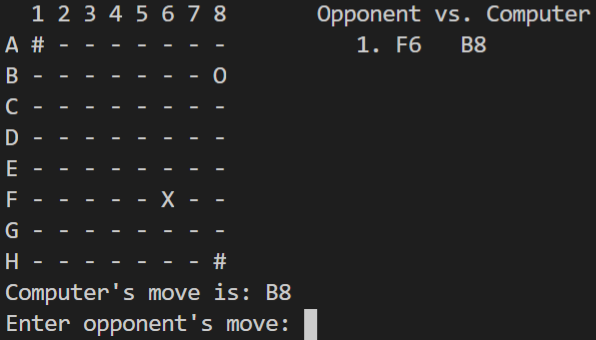

# **Isolation Board Game**

By Damian Ugalde

Professor Dominick A. Atanasio

California State Polytechnic University, Pomona

Project 4 for CS 4200 - Artificial Intelligence

## **Running the program**

---
Execute the following command:

`javac *.java && java Main`

## **How to play**

---

- Two players, **X** and **O**, start at opposing ends of an *8x8* board. Player **X** at position *A1* will start the game.
- Each time a player occupies a square on the grid, that square may not be used again.
- Each player is allowed to move as a queen does in chess. Moving in the horizontal, vertical or diagonal direction. They may move as many squares as desired in one direction until impeded by a square that has been used.
- Players take turns moving their pieces until there are no more moves available for that player. The player who can't move their piece during their turn loses the game.
- The game can't result in a tie. If a player moves their piece to a position where it won't be able to make a move in their next turn, but the opposing player can't make a move in between the two, the former wins.

### **Symbols**

---

- **X** Position of the *X* player
- **O** Position of the *O* player
- **-** empty square
- **#** Used Square

## **Agent Technique**

---
This game is played against a computer opponent. The agent uses The Minimax algortihm with Alpha-Beta search and iterative deepening to look the most optimal solution in an alloted time.

## **Why use Iterative Deepening?**

---
Performing iterative deepening allows us to have the benefits of a breadth-first search in the space complexity of depth-first search. It is impossible to reach the leaf-nodes at the beginning of the game since there is an exponential number of combinations.

With iterative deepening, we can search each depth and make an estimate in which move is best. If time still allows, we can go a level deeper and see if a better solution can be found. If there was no iterative deepening implemented, the search will continue in the same branch until it reaches a leaf-node or time runs out, not allowing the computer to search the other nodes.

Even though the leaf-nodes are what we are looking for, it is better to estimate with a heuristic over many possible solutions, rather than knowing where one solution will lead.

Eventually towards the end of the game, where the combinations are less, the computer will have enough time to reach the leaf-nodes and make optimal decisions. But for the beginning of the game, an estimate is as good as it can get.

### **Heuristic Approach**

---
Since it is impossible for the agent to reach the leaf-nodes that will determine the optimal solution, a heuristic (approximation) has to be made. In this case, the amount of moves that the computer has available is subtracted from the amount of moves that the opponent has remaining. Then, a linear value is assigned for the proximity of the computer to the center of the screen. This is because it is benefitial for the player to be in the center of the board, because it is less proned to being trapped by the edge of the board.

## **Screenshot of Gameplay**

---

